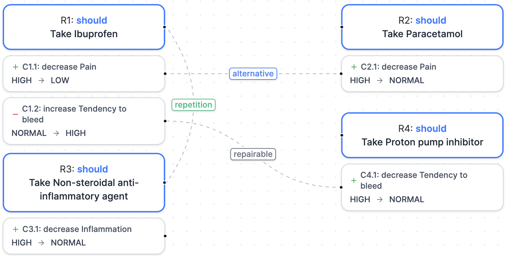

<p align="center">
     
    <div align="center">
        <a href="https://opensource.org/license/gpl-3-0"></a>
    </div>
</p>

<h4 align="center">An interaction management platform for computer-interpretable guidelines</h4>

<br/>
<br/>

<p align="center">
    
    <p align="center">
        <i>Example of detected interactions between recommendations from different guidelines</i>
    </p>
</p>

## Table of Contents

- [Background](#background)
- [Features](#features)
- [Deployment](#deployment)
- [Contributing](#contributing)
- [License](#license)


## Background

This repository contains the source code for the open-source project **TMR Web** (short for "**T**ransition-based **M**edical **R**ecommendations).
TMR Web is an interaction management platform for computer-interpretable guidelines which provides a web-based interface for healthcare professionals to manage and resolve potential conflicts arising from the application of multiple clinical guidelines to a single patient.

The model initially implemented within this project was loosely based on the work of [Zamborlini et al.](https://doi.org/10.1016/j.artmed.2017.03.012). 


## Features

At the moment, the application provides the following features pertaining to guideline management:

- **Knowledge acquisition**: The platform allows users to input and manage clinical guidelines in a structured format, while providing a user-friendly interface for data entry. This can be done via the _guideline builder_ tool.
- **Sharing and collaboration**: Users can share guidelines with other healthcare professionals, facilitating collaboration and knowledge exchange. The _guideline viewer_ allows users to view guidelines that are not owned by them.
- **Interaction detection**: The platform automatically detects potential conflicts between guidelines based on their contributions and the SNOMED CT terminology.

Additionally, documentation is provided for the API endpoints, which can be accessed at `/docs/` once the application is running. 

## Deployment

The application can be deployed using Docker. Ensure you have Docker and Docker Compose installed on your machine. Additionally, there are **two prerequisites** that need to be fulfilled before deploying the application:

1. **SNOMED server**: The application requires a SNOMED server to function correctly. You can either use a self-hosted server, like [Snowstorm](https://github.com/IHTSDO/snowstorm), or a public SNOMED server, such as the one provided by [NHS Digital](https://termbrowser.nhs.uk/).
If you choose to use a self-hosted server, ensure it is running and accessible before proceeding with the deployment.
2. **Resend API key**: The application uses the [Resend](https://resend.com/) service to send emails. You need to sign up for an account on Resend and obtain an API key. 

Once you have fulfilled the prerequisites, follow these steps to deploy the application:

1. Copy the the following files to your local machine:
   - `docker-compose.yml` and `.env.sample` to your project's root directory `./`
   - `proxy/Caddyfile` to `./proxy/`
2. Rename the `.env.sample` file to `.env`.
3. Open the `.env` file and configure the environment variables as needed. You DON'T need to change the compose file. 
4. Run the following command to start the application and it should be accessible at `http://localhost`:

```bash
docker-compose up -d
```

## Contributing

Contributions are welcome! Please fork the repository and create a pull request with your changes. For major changes, please open an issue first to discuss what you would like to change.

## License

This project is licensed under the GPL-3.0 License - see the [LICENSE](LICENSE) file for details.

